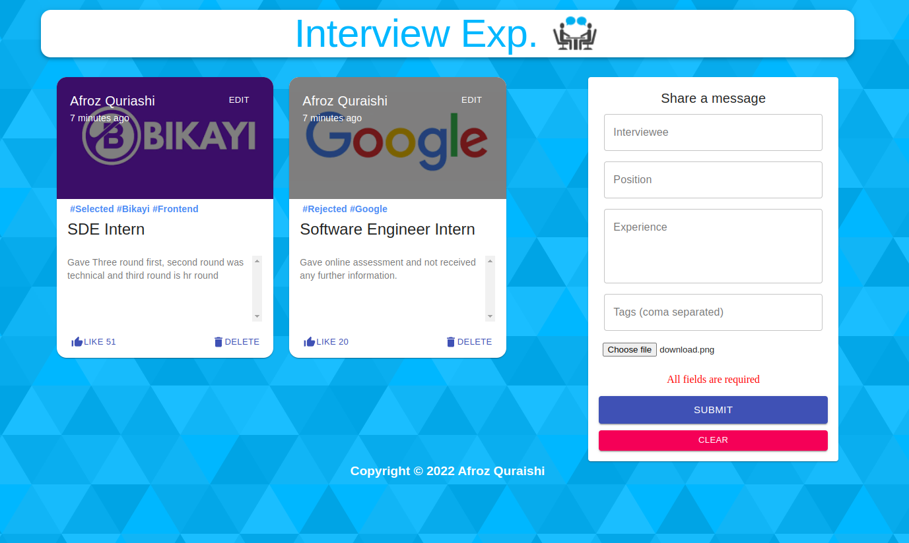

# Interview Experience Application

## Project Title

Interview Experience Mern Stack(MongoDB, expressjs, Reactjs, Nodejs) bassed application.

## Specific Introduction and details of Project

Using React.js, Node.js, Express.js, MongoDB, and Redux to build a Full Stack Application. The App is called "Interview Experience Application" and it is based on the social media app concept where all users all allow posting the interview experiences that they gave in their past so that users can be benefited from the experience, users can like, delete their post and user can share suggestions so that we don't repeat it in the future interviews.

## Objectives

- People can share and read the Interview Experience.

#### Features

- Great design and functionality.
- User can share there Interview Experience.
- User can like, delete and edit there exprience.
- If you try to add interview experience with blank fields then you will get error accordingly.

## Technologies Details

### Backend Technologies

- Node, Express

### Frontend Technologies

- ReactJs, Material Ui, Redux

### Database

- MongoDB, mongooose

## Setup

- client side
  Go to client directory and run `npm i && npm start` command.
- server side
  Go to server directory and run `npm i && npm start` command.

## Deployment

> You can test it [here]()
